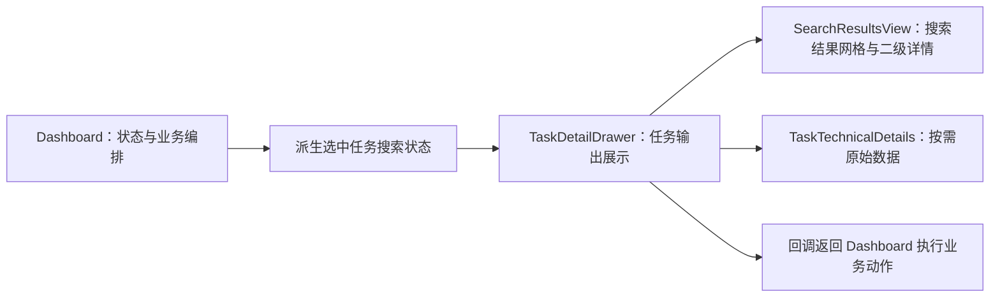

# 任务详情抽屉组件拆分说明

> 完成日期：2026-07-27
> 对应计划：工程化优化阶段 F（结构化拆分与冗余清理）
> 兼容约束：任务入口、任务数据、搜索结果、下载与阅读回调均保持不变。

## 1. 拆分目标

`dashboard.tsx` 同时承担任务编排、文件库、在线阅读器、筛选表单和多个详情抽屉，
拆分前共有 4,907 行。任务详情区域已经具备清晰边界：

- 输入是一个选中任务及其派生搜索状态；
- 输出是重跑、关闭、复制、选择、加载更多、阅读和下载动作；
- 搜索、整本下载、补缺三种输出只负责展示，不直接请求 API；
- 技术详情继续按需序列化，不改变已有性能策略。

因此本轮只抽取任务详情抽屉，不同时搬动文件库和阅读器，避免一次重构跨越多个业务域。

## 2. 调整后的职责

| 模块 | 当前职责 |
| --- | --- |
| `dashboard.tsx` | 维护状态、过滤搜索结果、执行 API 动作、合并任务 |
| `task-detail-drawer.tsx` | 展示任务进度及三种任务输出，转发用户动作 |
| `search-results-view.tsx` | 搜索结果排序、网格、选择和漫画二级详情 |
| `task-technical-details.tsx` | 展开后才序列化并显示原始输入输出 |

新组件不导入 API 请求函数，也不读取浏览器存储。这样展示层不会绕过仪表盘的业务编排。

## 3. 数据与兼容性

搜索结果派生状态使用 `TaskDetailSearchState` 统一传递：

- 已应用全局禁用词的结果；
- 已选择结果键；
- 可见来源错误数和排除数量；
- 是否还有下一页、加载状态和加载错误。

现有 `Task`、`TaskOutput` 和 `TaskSearchResult` 类型没有增加或删除字段。
所有按钮仍调用原来的仪表盘函数，因此任务重跑、批量下载、在线阅读和单条下载链路不变。

## 4. 规模变化

| 文件 | 调整前 | 调整后 |
| --- | ---: | ---: |
| `dashboard.tsx` | 4,907 行 | 4,801 行 |
| 独立任务详情组件 | 0 行 | 240 行 |
| 新增组件测试 | 0 行 | 133 行 |

总行数因显式属性类型、空安全分支和测试增加，但最大的状态组件减少 106 行，
任务详情的修改不再需要进入仪表盘内部的大段渲染函数。

## 5. 验收

- 新增测试覆盖来源部分失败、禁用词排除统计、批量下载、重跑、关闭和路径复制；
- 原有搜索结果一级网格与二级详情组件继续复用；
- TypeScript 对选中任务进行了显式空值收窄；
- 不新增第三方依赖；
- 完整检查、桌面和移动端浏览器回归必须通过后才可发布。

## 6. 后续阶段 F

下一批拆分继续按业务域推进，候选顺序如下：

最近在线阅读会话列表已在下一批完成拆分。其余候选顺序如下：

1. 文件库主视图与批量工具栏；
2. 本地阅读器和远程阅读器共享的控制栏、图片状态展示；
3. 将仅用于展示的纯函数继续移入模型层。

每次只处理一个可独立回滚的纵向模块，避免形成参数过多的“空壳组件”。
