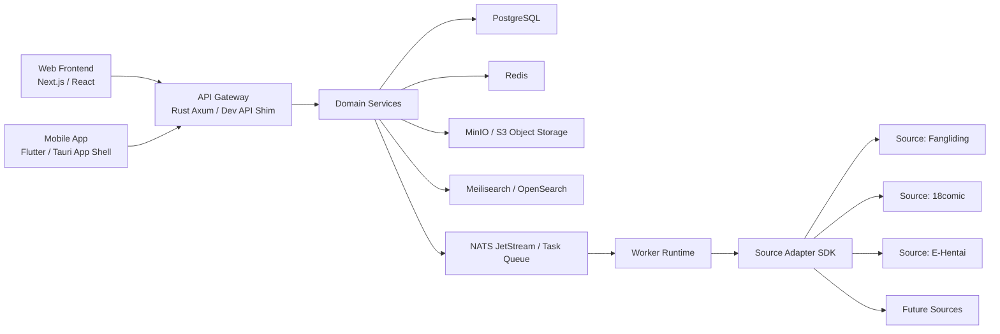
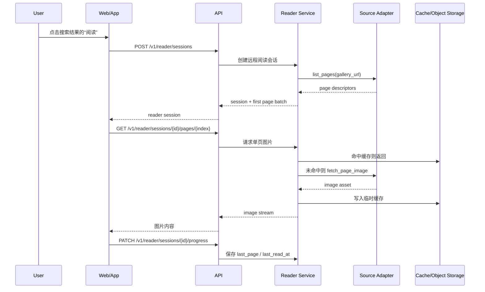
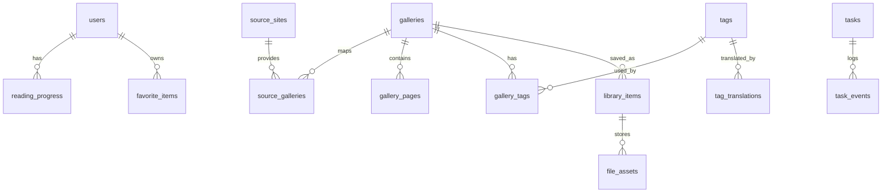

# 项目架构与数据库设计

更新时间：2026-06-25

## 1. 项目定位

本项目的目标不是单纯的漫画下载器，而是一个面向长期扩展的多源漫画聚合、检索、在线阅读与个人/公开书库平台。

短期目标：

- 支持多个源站同时检索，并把结果合并展示。
- 支持 tag 多词条检索，多个 tag 之间可以用逗号、分号、空格或换行分隔。
- 支持搜索结果直接进入在线阅读，不要求用户先下载整本漫画。
- 支持本地书库管理、阅读进度、导出和补缺。

长期目标：

- Web 端与 App 端共用同一个后端。
- 支持用户账号、收藏、历史记录、推荐、同步和公开访问。
- 支持更多源站，但所有源站能力都必须走统一适配器抽象。
- 支持标签翻译、中文 tag 输入、双语 tag 展示和高级筛选。

## 2. 总体架构



设计原则：

- 前端只负责交互，不直接承担爬取、下载、缓存和鉴权逻辑。
- 后端统一管理任务、阅读会话、缓存、用户数据和源站适配器。
- 源站差异只能进入 adapter 层，不能污染搜索、阅读、书库等通用业务模块。
- 下载是离线能力，在线阅读是独立能力，二者共享页列表和图片缓存。
- 整本下载必须有可见进度、超时和孤儿任务恢复；源站 bridge 通过结构化进度事件向 Task Service 回传 `total/done/failed/last_index`，前端同时用 SSE 和轮询兜底同步任务状态。下载目标按页序号保留，不按重复 `image_url` 合并；过小图片响应会被视为占位图或拦截结果并计入失败，任务若提前停止或没有保存任何可用页，最终状态必须是 failed，避免假完成。
- Library Service 必须对已下载目录提供健康诊断，统一识别缺页、失败记录、下载中断和疑似占位小图；网页端和未来 App 端只消费统一 `health` 结果，不直接解析本地日志格式。客户端可以按 `ok`、`warning`、`failed` 或 `needs_attention` 过滤文件库。

## 3. 后端模块边界

| 模块 | 职责 |
|---|---|
| API Gateway | 统一 REST/SSE/WebSocket 接口、参数校验、错误封装、鉴权入口 |
| Source Adapter Registry | 管理源站配置、能力声明、适配器加载和能力校验 |
| Search Service | 多源检索、结果合并、去重、排序、错误降级 |
| Gallery Service | 统一漫画实体、源站映射、详情解析、页列表解析 |
| Reader Service | 在线阅读会话、按页加载、邻近页预取、临时缓存 |
| Library Service | 本地/云端书库、收藏、阅读状态、导出、补缺 |
| Tag Service | 原始 tag、tag 翻译、别名、中文输入反查 |
| Task Service | 搜索、下载、补缺、导入、同步等长任务生命周期 |
| Storage Service | 图片、封面、CBZ/PDF、临时缓存、对象存储路径 |
| Audit & Rate Limit | 公开化后的访问审计、限流、风控和滥用处理 |

## 4. 源站适配器抽象

每个源站必须声明自己的能力：

```json
{
  "id": "18comic",
  "name": "18comic.vip",
  "capabilities": [
    "search",
    "gallery",
    "download",
    "retry_folder",
    "page_list",
    "page_image",
    "online_read"
  ]
}
```

推荐 adapter 接口：

```text
search(tags, name, query, limit) -> SearchResult[]
read_gallery(gallery_url) -> GalleryMeta
list_pages(gallery_url) -> PageDescriptor[]
fetch_page_image(gallery_url, page_url, page_index) -> ImageAsset
download_gallery(gallery_url) -> GalleryDownloadReport
retry_folder(folder, range) -> RetryPlan
```

约束：

- 不允许绕过登录、验证码、年龄门、封禁或限流。
- 用户自行提供的合法 cookie/header 可以作为 adapter 配置。
- adapter 必须返回结构化错误，前端应显示“部分源失败，但其余结果仍可用”。
- 新增源站不能新增一套独立前端组件，必须复用统一搜索结果、阅读器和任务组件。

## 5. 在线阅读链路



用户体验要求：

- 搜索结果里应该有“阅读”和“下载”两个清晰动作。
- 阅读按钮优先打开内置阅读器；下载按钮只负责离线保存。
- 直链 URL 也应该能直接打开阅读器，不必先创建下载任务。
- 阅读器必须支持上一页、下一页、页码跳转、缩略图/临近页预取、适配宽度，以及单页/连续滚动两种阅读模式。
- 已读过的远程会话应出现在“最近在线阅读”区域，继续阅读时优先回到 `last_page`。
- 如果源站只支持下载，不支持在线阅读，按钮应禁用并给出清楚提示。

开发期实现：

- 远程阅读会话保存到 `.data/dev-api/reader-sessions.json`，服务重启后仍可恢复页列表。
- 会话快照额外保存 `last_page` 与 `last_read_at`，前端打开搜索结果、直链或翻页时通过进度接口更新；预取图片不应改变真实阅读进度。
- 前端阅读器会拉取当前页前后若干页的 page descriptor，并预热对应图片缓存；底部显示预载状态，预载失败不影响当前页阅读。
- 阅读模式由前端通用 `ReaderMode` 管理，本地书库和远程在线阅读共用同一个单页/连续滚动切换；连续模式只消费统一的页面契约，不要求源站适配器额外定制 UI 逻辑。
- 连续滚动模式由阅读器层通过视口可见页识别同步当前页，并对本地书库进度和远程 `PATCH /v1/reader/sessions/{id}/progress` 做防抖保存；源站 adapter 仍只负责页列表和单页图片。
- 阅读器主图由统一图片状态层渲染，支持加载中占位、失败提示和单页重试；重试会通过 `reader_retry` 或 `refresh=1` 清除当前页的临时缓存并重新请求图片，不改变页列表、阅读进度或源站 adapter 契约。
- 直链在线阅读在未指定 `source_id` 时由 Reader Service 按 `gallery_url` 域名匹配支持 `online_read` 的源站；网页端和未来 App 端都应复用该后端推断能力，而不是在客户端逐个源站盲试。
- 单页图片接口会记录当前会话页的失败原因，并通过 `GET /v1/reader/sessions/{id}/pages/{index}/status` 暴露 `pending`、`ready`、`failed` 状态；前端失败层必须显示该诊断信息，避免用户只看到空白或坏图。
- Reader Service 额外提供 `GET /v1/reader/sessions/{id}/pages/status` 批量状态接口，前端用它给缩略图、页码按钮和连续滚动页显示已就绪/加载中/失败状态，并提供失败页批量重试与跳过失败页动作。
- Reader Service 负责远程阅读记录和缓存维护，提供删除会话与按当前页/整本清理缓存的接口；网页端历史面板支持筛选、展开、删除记录和清理缓存，未来 App 端应复用同一组维护接口。
- 远程阅读书签属于 Reader Service 的用户阅读元数据，提供添加/更新当前页书签、删除书签和按书签跳转；源站 adapter 不保存用户书签，未来正式后端应迁移到 `reading_progress` 或独立 `reading_bookmarks` 表。
- `e-hentai` 作为内置源站通过 `scripts/ehentai_bridge.py` 接入，复用统一 SourceAdapterRegistry、Python bridge core、`list-pages` 和 `download-page` 契约；搜索解析 `/g/{gid}/{token}/`，在线阅读解析 `/s/{page_token}/{gid}-{index}`，单页图片优先读取 `img#img`。
- `18comic` 与 `e-hentai` 的下载桥接共享按页下载、最小图片体积校验和结构化进度回传策略；如果源站返回 30x30 一类占位小图，任务会显示明确失败原因，不会把假图片写成成功页。
- 单页图片按需缓存到 `.data/page-cache`，不进入正式书库。
- 未来正式后端应把会话、页列表和阅读进度迁移到 PostgreSQL，把图片缓存迁移到 MinIO/S3。

## 6. PostgreSQL 数据库设计

核心选择：PostgreSQL 做主库，Redis 做缓存和临时状态，MinIO/S3 做图片文件存储，搜索引擎用于全文和 tag 检索加速。

### 6.1 核心关系



### 6.2 表分组

| 表 | 作用 |
|---|---|
| users | 用户账号，公开化时启用 |
| source_sites | 源站配置、能力、启用状态 |
| source_galleries | 某个源站上的原始漫画条目 |
| galleries | 系统内部统一漫画实体，用于合并多源结果 |
| gallery_pages | 页列表，在线阅读和下载共用 |
| tags | 原始 tag，保留命名空间 |
| gallery_tags | 漫画与 tag 的多对多关系 |
| tag_translations | tag 翻译、别名、简介、数据来源 |
| tasks | 长任务当前状态 |
| task_events | 长任务过程事件 |
| library_items | 用户入库/收藏的漫画 |
| file_assets | 封面、图片、压缩包、PDF 等文件资产 |
| reading_progress | 用户阅读进度 |
| favorite_items | 收藏、稍后看、评分 |
| source_credentials | 用户自己的源站 cookie/token，加密保存 |
| audit_logs | 公开化后的访问审计 |

### 6.3 关键表草案

```sql
create table source_sites (
  id text primary key,
  name text not null,
  homepage text,
  enabled boolean not null default true,
  adapter_kind text not null,
  capabilities jsonb not null default '[]',
  config jsonb not null default '{}',
  created_at timestamptz not null default now(),
  updated_at timestamptz not null default now()
);

create table galleries (
  id uuid primary key,
  title text not null,
  normalized_title text not null,
  cover_asset_id uuid,
  page_count integer,
  metadata jsonb not null default '{}',
  created_at timestamptz not null default now(),
  updated_at timestamptz not null default now()
);

create table source_galleries (
  id uuid primary key,
  source_id text not null references source_sites(id),
  gallery_id uuid references galleries(id),
  source_gallery_key text not null,
  gallery_url text not null,
  title text not null,
  page_count integer,
  tags jsonb not null default '[]',
  raw_metadata jsonb not null default '{}',
  last_seen_at timestamptz not null default now(),
  unique (source_id, source_gallery_key)
);

create table gallery_pages (
  id uuid primary key,
  gallery_id uuid references galleries(id),
  source_gallery_id uuid references source_galleries(id),
  page_index integer not null,
  page_url text,
  image_url text,
  asset_id uuid,
  width integer,
  height integer,
  status text not null default 'pending',
  created_at timestamptz not null default now(),
  updated_at timestamptz not null default now(),
  unique (source_gallery_id, page_index)
);

create table tags (
  id uuid primary key,
  namespace text not null default 'tag',
  raw_name text not null,
  normalized_name text not null,
  created_at timestamptz not null default now(),
  unique (namespace, normalized_name)
);

create table gallery_tags (
  gallery_id uuid not null references galleries(id),
  tag_id uuid not null references tags(id),
  source_id text references source_sites(id),
  confidence numeric(5, 4) not null default 1,
  primary key (gallery_id, tag_id)
);

create table reading_progress (
  id uuid primary key,
  user_id uuid references users(id),
  gallery_id uuid references galleries(id),
  source_gallery_id uuid references source_galleries(id),
  last_page integer not null default 1,
  total_pages integer,
  last_read_at timestamptz not null default now(),
  device_kind text,
  metadata jsonb not null default '{}',
  unique (user_id, source_gallery_id)
);
```

多词条 tag 检索：

```sql
select gallery_id
from gallery_tags
where tag_id = any($1)
group by gallery_id
having count(distinct tag_id) = cardinality($1);
```

### 6.4 标签翻译

推荐接入 EhTagTranslation/Database，但要注意其文本数据采用 CC BY-NC-SA 3.0，公开化或商业化前需要重新确认授权边界。

```sql
create table tag_translations (
  id uuid primary key,
  tag_id uuid not null references tags(id),
  language text not null default 'zh-CN',
  translated_name text not null,
  intro text,
  aliases jsonb not null default '[]',
  source_name text not null,
  source_version text,
  updated_at timestamptz not null default now(),
  unique (tag_id, language, source_name)
);
```

前端展示建议：

```text
female:big breasts / 女性:巨乳
language:chinese / 语言:中文
```

中文输入时，Tag Service 应先在 `tag_translations` 和 `aliases` 中反查原始 tag，再进入源站检索或本地库检索。

## 7. 缓存与文件存储

| 类型 | 存储位置 |
|---|---|
| 临时阅读页缓存 | Redis 元数据 + MinIO/S3 或本地 `.data/page-cache` |
| 已下载图片 | MinIO/S3，开发期可落到 `.data/downloads` |
| 封面 | file_assets |
| 导出 CBZ/PDF | file_assets |
| 任务日志 | PostgreSQL task_events |
| 热门 tag/搜索建议 | Redis + 搜索引擎 |

原则：

- 在线阅读缓存有生命周期，可以自动清理。
- 已入库漫画的文件资产不能随临时缓存清理。
- 所有文件路径必须在项目配置的存储根目录下，不能散落到系统盘。
- 文件库扫描应输出健康状态，至少包括期望页数、已保存图片数、缺页数、失败页记录、疑似小图数量和最近下载状态；正式后端应把该诊断下沉到 `library_items` 或独立 `library_health_snapshots`。健康状态过滤是 API 契约能力，不应只留在网页端本地状态。

## 8. 公开化准备

公开化之前必须增加：

- 用户账号和角色权限。
- 用户级、IP 级、源站级限流。
- 源站凭据加密存储。
- 任务审计日志。
- 文件访问鉴权。
- 内容投诉和下架流程。
- adapter 运行隔离，避免单个源站故障拖垮全站。

## 9. 当前落地顺序

第一阶段：

1. 完成远程阅读会话 API。
2. 搜索结果增加“直接阅读”入口。
3. 18comic 使用已有 `list-pages` 和 `download-page` 桥接命令接入在线阅读。
4. 源站能力新增 `page_list`、`page_image`、`online_read`。
5. 直链 URL 支持直接打开在线阅读器。
6. 最近在线阅读记录支持继续上次页码。

第二阶段：

1. 把远程阅读会话、页列表和阅读进度持久化到 PostgreSQL。
2. 把 tag、gallery、page 建成正式业务表。
3. 加入 EhTagTranslation 数据导入器。
4. 本地书库与远程阅读统一进度模型。

第三阶段：

1. App 端复用同一套 API。
2. 用户系统、同步、推荐和公开访问。
3. 源站 adapter 插件化、隔离化和可热更新。
